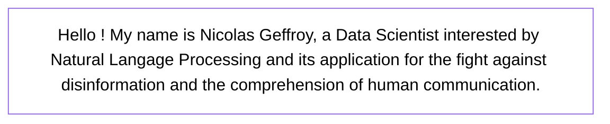

# **
 😃 On my way to solve disinformation and human communication I guess 😃 
**

  
  

 

## 👨‍💻 As a Data Scientist...

I have been trained in data science through the [IODAA training program](https://www.agroparistech.fr/formations-ingenieur/3a-3e-annee-ingenieur-dominante-linformation-decision-par-lanalyse-lapprentissage) of AgroParisTech.   
I especially like working with **time series**, **images** and **text** and the more **multimodal** they are, the better it is !   
My programming langage are **Python** (torch, sklearn...), **R** (Tidyverse, Rshiny...), **SQL**.   
For reproducibility, I mainly use **Nextflow** (for workflow system) **Docker** (for environment management) and of course **GitHub** (for storing and sharing my codes).

## 📝 Projects

### [Agrocam_agro_chara](https://github.com/nicolasgeffroy/agrocam_agro_chara) 🌳📸📈

*Extracts and predicts agronomic parameters from vineyard images*

- Consist of a **pipeline of 4 blocks** (Segmentation/Extraction/Selection/Prediction) combining **CNN** (MobileNet, DeepLab), **RNN** (LSTM) and **unsupervised model**.
- Real vineyard images : Taken on the spot with all nature's **unpredictability**
- Blocks can be **used separately** (with the Core block)
- Performance => Segmentation : 0.72 (IoU) /// Prediction : 0.06 (MSE)

### [ReproHackathon_G6](https://github.com/raphaelrubrice/ReproHackathon_G6) 🔃🧬📄

*Reproduce part of the results shown in the paper [Intracellular Staphylococcus aureus persisters upon antibiotic exposure](https://doi.org/10.1038/s41467-020-15966-7)*

- Consist of a **Nextflow pipeline** of an RNA-Seq analysis, consisting of steps of trimming, mapping, counting and stat analysis.
- Each step of the analysis is linked to a **docker** environment.

### [Projet_fil_rouge_2024](https://github.com/JhonatanFelix/Projet_fil_rouge_2024) 🌾🧬⚠️

*Various analysis to highlight genes which plays a role in stress response*

## ❓ And after ?

- Interested in the analysis of the [CID database](https://www.ortolang.fr/market/corpora/sldr000027) because of its interdisciplinarity and the great number of NLP task that it offer.
- **Looking for a PhD in NLP applied to the fight against disinformation** or other NLP application.
